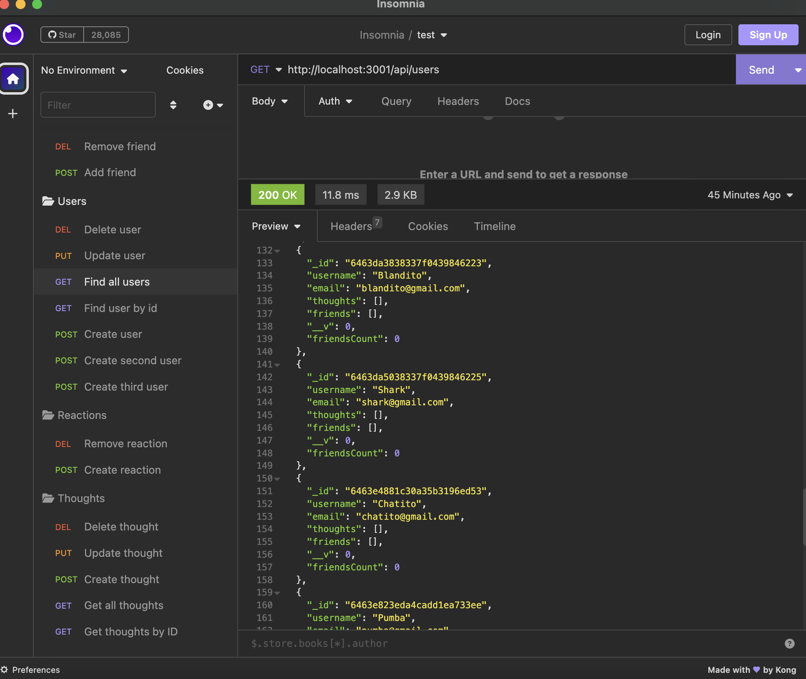
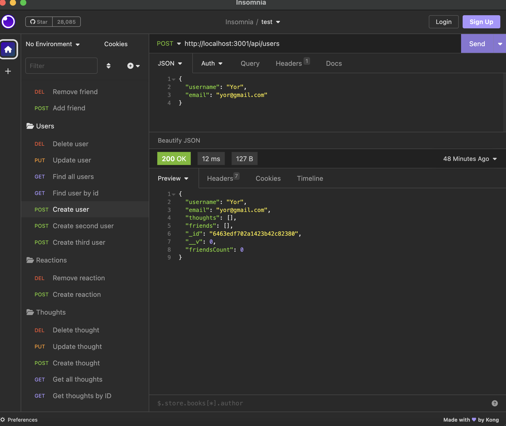
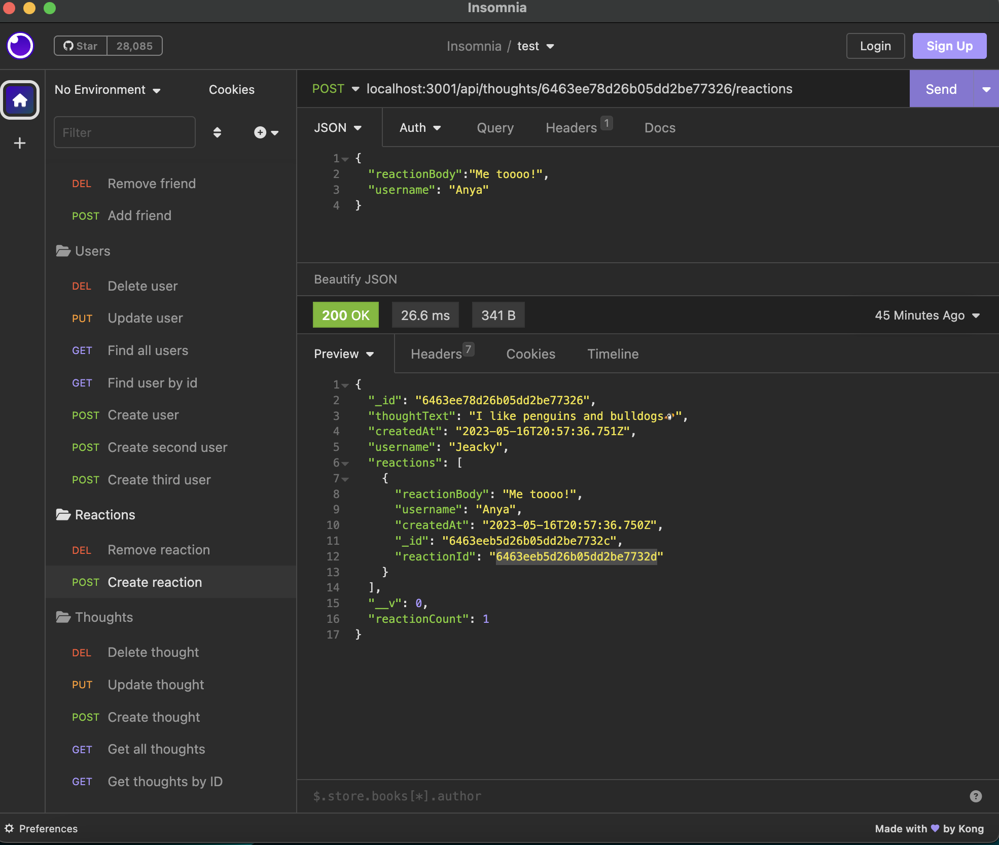
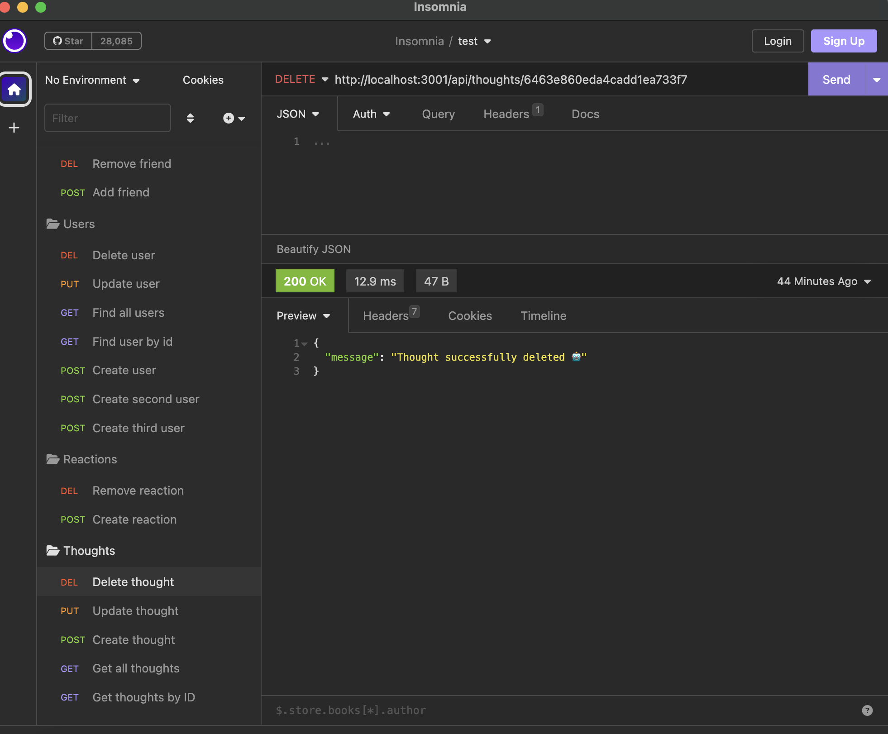

# Thoughts
 This is an API for a social networking web application where users can share their thoughts, react to their friends' thoughts, and create a friends list. The application is built using technologies like Express.js, MongoDB, and Mongoose.


## Usage
With this social networking API, users can perform the following actions:
```md
* Register as a new user with a username and email.
* View the list of existing users.
* Get detailed information of a specific user by their ID.
* Update their own user profile information.
* Delete their user account.
* Add friends to their friends list.
* Remove friends from their friends list.
* Post thoughts and share them with other users.
* View the list of existing thoughts.
* View details of a specific thought.
* Update or delete their own thoughts.
* React to thoughts of other users.
* Remove their own reactions to thoughts.
```

## Technologies
The application utilizes the following technologies:

```md
* Node.js: Development platform for server-side JavaScript.
* Express.js: Node.js web framework used for routing and handling HTTP requests.
* MongoDB: NoSQL database used for storing application data.
* Mongoose: Object modeling library for Node.js that provides a simple interface to interact with MongoDB.
```

## Installation
To install and run the application in your local environment, follow these steps:

- Clone the GitHub repository to your local machine.

- Ensure that you have Node.js and MongoDB installed on your system.

- Run npm install in the root directory of the application to install the necessary dependencies.

- Configure the MongoDB database connection in the configuration file.

- Run npm start to start the application server.

- Use an API testing tool like Insomnia to make requests and test the API functionality.







[GitHub/Jeacqueline Thoughts](https://github.com/Jeacqueline/Thoughts)

[Video/ Jeacqueline/ Thoughts](https://drive.google.com/file/d/13xgOZj3VQSjbUt0iG92PbNPoNkrlqbYr/view)

